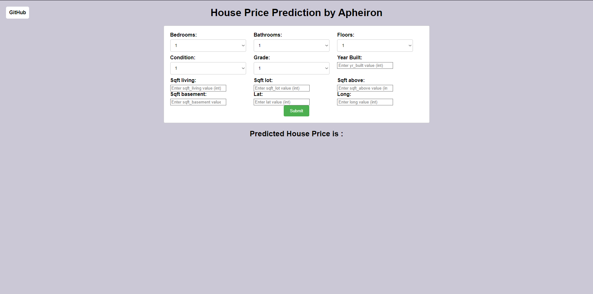

# End to End House Price Prediction by Apheironn

### Introduction About the Data :

**The dataset** The goal is to predict `price` of given house (Regression Analysis).

There are 12 independent variables:

* `bedrooms` : Number of Bedrooms/House
* `bathrooms` : Number of bathrooms/bedrooms
* `sqft_living` : Square footage of the home
* `sqft_lot` : Square footage of the lot
* `sqft_above` : Square footage of house apart from basement
* `sqft_basement` : Square footage of the basement
* `floors` : Total floors (levels) in house
* `condition` : How good the condition is Overall
* `grade` : Overall grade given to the housing unit, based on King County grading system
* `yr_built ` : Built Year
* `lat` : Latitude coordinate
* `long` : Longitude coordinate
  
Target variable:
* `price`: Price of the given house.

Dataset Source Link :
https://dataplatform.cloud.ibm.com/data/notebooks/converter/assets/79a436d6-51b7-4cb3-962d-5d2bbcb37e78?access_token=025031e1b7902891194b22266aee25230c88c44cfbb55cf3db2e0a7b712c7017&project=87db0240-1cfa-47f3-8b98-396d95cf2671

# Screenshot of UI

# Approach for the project 

1. Data Ingestion : 
    * In Data Ingestion phase the data is first read as csv. 
    * Then the data is split into training and testing and saved as csv file.

2. Data Transformation : 
    * In this phase a ColumnTransformer Pipeline is created.
    * for Numeric Variables first SimpleImputer is applied with strategy median , then Standard Scaling is performed on numeric data.
    * for Categorical Variables SimpleImputer is applied with most frequent strategy, then ordinal encoding performed , after this data is scaled with Standard Scaler.
    * This preprocessor is saved as pickle file.

3. Model Training : 
    * In this phase base model is tested . The best model found was catboost regressor.
    * After this hyperparameter tuning is performed on catboost and knn model.
    * A final VotingRegressor is created which will combine prediction of catboost, xgboost and knn models.
    * This model is saved as pickle file.

4. Prediction Pipeline : 
    * This pipeline converts given data into dataframe and has various functions to load pickle files and predict the final results in python.

5. Flask App creation : 
    * Flask app is created with User Interface to predict the house prices inside a Web Application.

# Exploratory Data Analysis Notebook

Link : [EDA Notebook](./notebook/EDA.ipynb)

# Model Training Approach Notebook

Link : [Model Training Notebook](./notebook/MODEL_TRAINING.ipynb)

# Docker

Link : https://hub.docker.com/repository/docker/apheiron/house_predict

# Azure

Link : https://apheironhousepredict.azurewebsites.net
